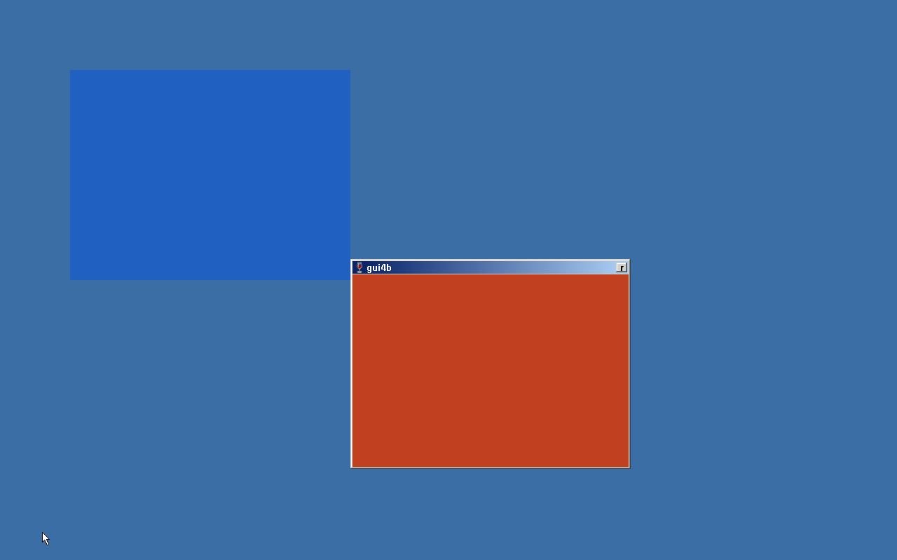

# proskrnl

**A minimal, Windows-NT-semantics-compatible kernel that boots on bare metal (or a VM),
runs the Wine user-mode stack unmodified, and — eventually — opens a real Windows
application in a window.**

proskrnl is not a Windows clone and not a ReactOS competitor. It is a deliberate,
narrow bet:

> Reimplement only the part of Windows that is a **clean, observable boundary** — the
> `Nt*` system-call surface plus the PEB/TEB/file semantics that user mode can see —
> and reuse everyone else's 30 years of work for the parts above and below it.

- **Above the boundary:** the Wine PE user-mode DLLs (ntdll, kernelbase, user32,
  gdi32, …). We swap only ntdll's unix backend for our own syscall stubs. Wine's
  three decades of message-ordering and API-behaviour compatibility come along for free.
- **Below the boundary:** we write drivers ourselves — but only for a *chosen*,
  spec-documented hardware set (virtio first). No Windows driver ABI, no IRP, no PnP.

## Why this can work when ReactOS took 30 years

ReactOS chose the *dirty* boundary: binary compatibility with Windows kernel-mode
drivers. That boundary is a contract over **struct layouts and context-dependent
timing**, which is untestable, unmarshalable, and impossible to redesign around once
drivers depend on it. It taxed every commit and paid out only after everything was
finished.

proskrnl chose the *clean* boundary. It is:

- **narrow** — a few hundred `Nt*` calls, and only the subset Wine actually uses;
- **observable** — everything crossing it can be exercised from an unprivileged `.exe`;
- **already specified** — Wine's test suite is a third-party, Windows-verified,
  legally-clean specification of that boundary, and we import it.

The correct comparison for proskrnl is not ReactOS or Wine. It is **FreeBSD's
Linuxulator**: a small, maintainable ABI-compatibility layer over a clean, stable,
observable syscall surface — except placed on bare metal instead of on a host OS.

## Scope

- **Final goal:** CUI is the supported target. A hacky, opt-in GUI path exists on top
  (see `docs/07-gui-strategy.md`), but it is strictly additive and removable.
- **Not in scope (by design):** the Windows driver ABI, win32k-as-NT-built-it, the NT
  cache manager as a separate component, pageout/working-set management, a real
  security model (initially), ALPC, HAL as a swappable module.

## Where to start reading

1. `docs/00-overview.md` — the design in one sitting.
2. `docs/09-constitution.md` — **the hard rules. Read before writing a line of code.**
3. `docs/02-milestones.md` — the plan, M1 through WOW64.
4. `docs/13-glossary.md` — if terms like IRQL, APC, or "section object" are unfamiliar.

## Prerequisites (development toolchain)

Supported host environments: **macOS** (Apple Silicon or Intel) and **Linux**
(x86-64; instructions below are for Debian/Ubuntu). The tool set is the same on
both — clang + lld (freestanding cross-toolchain), QEMU (the run/test loop,
`docs/08`), Limine (the bootloader, ADR 0010), mtools + sgdisk
(`tools/mkimage.sh` builds the GPT/FAT32 image without mounting), GNU make,
and python3 (the `tools/gen_*.py` generators).

The version-sensitive dependencies are **pinned git submodules** under
`third_party/` so every environment builds against the same bits: `limine`
(bootloader stages + deploy tool, a `-binary` release branch), `limine-protocol`
(the kernel-facing boot-protocol header), `qemu` (the official GitHub mirror,
a fallback for hosts with no QEMU — see below), `freetype` (the font backend, built twice: a PE
static library for the target and a native one for the oracle), and `wine`
(both the `abi/` generation source *and* the ntapi oracle runtime). `tools/mkimage.sh`, `tools/qemu.sh`, and
`tests/run/run.sh` all prefer the in-tree builds automatically and fall back to
host tools on PATH.

### macOS (Homebrew)

Install everything with `brew bundle` (reads `./Brewfile`), or the M1-critical
set directly:

```sh
brew install llvm lld qemu limine mtools gptfdisk
```

- **llvm + lld** — the freestanding cross-toolchain: `clang --target=x86_64-elf`,
  `llvm-objcopy`, and `ld.lld` (macOS's own `ld` is Mach-O only). Homebrew's `llvm` is
  **keg-only** *and does not ship `ld.lld`* — point the build at `/opt/homebrew/opt/llvm/bin`
  and install **`lld` separately**.
- **qemu** — `qemu-system-x86_64`, the run/test loop (`docs/08`). On Apple Silicon the
  x86-64 guest runs under TCG emulation (no HVF) — correct, just slower.
- **limine** — the bootloader (ADR 0010); provides the `limine` deploy tool.
  Optional: the pinned `third_party/limine` submodule works on macOS too
  (`git submodule update --init third_party/limine{,-protocol} && make -C
  third_party/limine limine`) and takes precedence over the brew keg.
- **mtools** — `mformat`/`mcopy`, to populate the FAT32 ESP without mounting
  (`tools/mkimage.sh`).
- **gptfdisk** — `sgdisk`, to lay down the GPT + BIOS-boot partition the Limine BIOS
  image needs (`tools/mkimage.sh`).

### Linux (Ubuntu 24.04)

One command:

```sh
tools/setup_linux.sh
```

It installs the apt toolchain (clang/lld, make, gdisk, mtools, mingw-w64, the
QEMU/Wine build dependencies) and then builds the pinned `third_party/`
submodules **in place** — no `sudo make install`, nothing on PATH to conflict
with distro packages:

- **limine** — the deploy tool is one `cc` invocation; the BIOS/UEFI boot
  stages come prebuilt on the pinned `-binary` release branch (upstream's
  intended integration), so no autotools/nasm and no network-fetching
  bootstrap.
- **qemu** — built from the pinned submodule (official GitHub mirror,
  `x86_64-softmmu` only) **only when the host has no `qemu-system-x86_64` on
  PATH**. There is no version floor: the kernel's clock drives the LAPIC timer
  through the xAPIC MMIO window, which every QEMU has, so `apt install
  qemu-system-x86` (8.2 on 24.04 LTS) runs the whole suite and the long source
  build is skipped.
- **wine** — the ntapi oracle runtime, built (64-bit, no X) from the very
  same pinned tree `abi/` is generated from, so the oracle and the contract
  cannot version-diverge. Since GUI-3 it is also the **font-metrics oracle**:
  configured `--with-freetype --without-fontconfig` against the pinned
  `third_party/freetype`, so the oracle and the target answer font questions
  from the same FreeType and the same font set, and no host fonts can leak
  into the spec.

The first run takes a while if Wine has to build; re-runs skip finished work.
Any distro QEMU works and is preferred over building one — the runner scripts
prefer the in-tree builds when they exist and fall back to PATH, and `QEMU=`,
`WINE=`, `LIMINE=`/`LIMINE_SHARE=` override either way.

### Ephemeral containers (Claude Code on the web, fresh CI-like boxes)

Building QEMU + Wine from source in a throwaway container wastes hours, so CI
publishes the finished build trees to the rolling `third-party-cache` GitHub
prerelease (zstd tarballs, keyed on the submodule pins — the publish step in
`.github/actions/third-party`, the prep every CI job shares).
`tools/fetch_third_party.sh` restores them in
minutes and then `tools/setup_linux.sh`'s skip-logic only installs the apt
toolchain:

```sh
tools/fetch_third_party.sh && tools/setup_linux.sh
```

For **Claude Code on the web**, paste exactly that line as the environment's
*setup script* (environment settings in the web UI): the sandbox snapshots the
filesystem after the setup script succeeds, so the download cost is paid once
per environment and every later session starts with the builds already in
place. Sessions without a configured setup script still recover: a
`SessionStart` hook in `.claude/settings.json` kicks off the same fetch in the
background on remote Linux containers. If the pins were bumped and main's CI
hasn't republished yet, the fetch fails loudly — fall back to
`tools/setup_linux.sh`.

### ntapi oracle target (both hosts; from M2, not needed for M1)

**mingw-w64** builds the tests as a Windows `.exe` (`docs/14`) and a **Wine**
runtime runs it: `tests/run/run.sh oracle`. On Linux both come from
`tools/setup_linux.sh` (the oracle wine is the pinned `third_party/wine` — see
above). On macOS, Homebrew's `wine-*` casks are deprecated (they fail macOS
Gatekeeper) — on Apple Silicon use the Game Porting Toolkit's `wine64`, or
better, run the oracle target on Linux/CI or Windows, which is smoother than
local macOS Wine.

## Status

**CUI-1 complete** (on M10's full Wine CUI userland): first boot runs
`wineboot --init`. `smss.exe firstboot` (`KiRunFirstBoot`) spawns a standalone
`wineboot.exe`, which drives `wine.inf`'s ~500-line machine-state registry
payload through `rundll32 setupapi,InstallHinfSection` children — the Cm
integration test ADR 0008 promised and an `NtCreateUserProcess` stress test.
The populated hive (~35 KB of `HKLM\Software` + `HKLM\System`) persists and
survives reboot; wineboot's own `.update-timestamp` check makes later boots
skip the work. The no-RTC deviation is retired: the CMOS clock seeds
`SystemTime` and FAT timestamps at boot. Two runtime-dormant setupapi seam
commits on the fork (ole32 + shell32 tolerance) let a registry-only install
run on a disk that bakes only the CUI DLL set; the baked `wine.inf` is
filtered to registry-only sections at image-bake time (`tools/filter_inf.py`).
The registry differential vs. the oracle's prefix (`tests/run/run.sh
firstboot`, the milestone's Art. 6 conviction gate) is green: the whole INF
payload — 195 keys / 345 values — matches the oracle exactly. **Not yet:**
the `HKLM\Software\Wow6432Node` mirror keys (WOW64 scope) and HKCU
population (needs the token surface, CUI-2); the differential excludes both
(`docs/03` "CUI-1 firstboot notes").

**CUI-2 complete**: the Se minimal-but-real security model. A real Ob token
object with ONE fixed identity — wineserver's `token_create_admin`,
byte-identical (user `S-1-5-21-0-0-0-1000`, 8 groups, 21 privileges, session
1, `TokenElevationTypeLimited`) — and the twelve token/security syscalls the
already-baked DLLs read (`kernel/se/`): open/query/adjust/duplicate,
`NtPrivilegeCheck`, `NtAccessCheck` (the wineserver ACE walk),
`NtQuery/SetSecurityObject`, `NtAllocateLocallyUniqueId`, plus the magic
token pseudo-handles. Pinned by `tests/ntapi/sem_se/` — 8 tests green on the
oracle AND proskrnl (Art. 5/6) — and by the acceptance the milestone names:
Wine's unmodified `whoami.exe` opens its own token under cmd.exe and prints
the logon SID (`tests/run/run.sh console`). HKCU now resolves
(`RtlFormatCurrentUserKeyPath` → `\Registry\User\S-1-5-21-0-0-0-1000`).
**Not yet:** impersonation attach (thread tokens — CUI-3, the SCM needs
them); object create/open stays always-allow (`NtAccessCheck` is a service,
Ob grants unconditionally); `NtSetInformationToken`/`NtFilterToken`/linked
tokens stay unimplemented until a baked caller convicts (`docs/03` "CUI-2 Se
notes").

**CUI-3 complete**: the SCM. Wine's unmodified services.exe, rpcss.exe,
sc.exe, and userenv.dll are baked (pure PE, prebuilt in the pinned tree —
zero fork commits, hack meter untouched); wineboot starts services.exe on
every boot and the wine.inf `AddService` payload installs through the live
SCM over `ncacn_np:[\pipe\svcctl]` — M9's npfs carries all of it and ALPC
stays permanently unimplemented. The kernel grew exactly what the SCM
convicts it of needing: a genuinely-pending `FSCTL_PIPE_LISTEN` on
asynchronous handles (`kernel/io/async.c` — rpcrt4's server loop deadlocks
on a blocking listen), `NtCancelIoFile(Ex)`, `FSCTL_PIPE_WAIT` on the
device-root open (WaitNamedPipe), job objects — the SCM subset
(`kernel/ps/job.c`: limits validated + stored, lifecycle packets through
the one completion-port engine), and a real `ProcessWineMakeProcessSystem`
(the global shutdown event; the old blanket-success stub handed
services.exe a NULL handle — the Art. 12 shape). Pinned by
`sem_pipe/async_listen`, `sem_pipe/pipe_wait`, `sem_ps/job`,
`sem_ps/make_system` — green on the oracle AND proskrnl — and by the
acceptance: `tests/run/run.sh scm` drives `sc query`/`sc start`/`sc create`
from cmd.exe (a real `svcctl` RPC round-trip), installs a third-party demo
service, reboots, and asserts the SCM auto-started it from the persisted
registry. **Not yet:** impersonation attach — re-deferred with evidence
(Wine's SCM never impersonates; `docs/03` "CUI-3 SCM notes"); job-limit
enforcement, job nesting, and the job query/terminate surface stay
loud-unbuilt.

**CUI-4 complete**: the process ecosystem. Processes can now be listed,
opened, read, suspended, killed and grouped from ring 3 —
`SystemProcessInformation` (the chained snapshot `CreateToolhelp32Snapshot`
walks) plus `ProcessSessionInformation`, `NtOpenProcess`,
`NtRead/WriteVirtualMemory` (cross-process through the HHDM, no CR3 games),
`NtGetNextProcess`, `NtSuspend/ResumeProcess`, and the job query/terminate/
open/in-job surface with `KILL_ON_JOB_CLOSE` enforced. Two long-standing
"no-preemption" deviations are retired with it. **Foreign termination**
(`taskkill`): nothing is torn down from the killer's context — the target is
flagged, woken, and pulled out of any wait, then reaps *itself* at its next
return to user mode through the ordinary exit path, which also required
auditing every indefinite kernel wait a user thread can park in (condrv's
stack-resident request, npfs, completion ports, byte locks). **Suspend** of
a thread that has already run works the same way, via a per-thread gate
consulted at each ring-3 edge. That edge is also where the kernel's one
preemption point now lives (`KiPreemptAtUserReturn`, the switch-at-user-
return Art. 3 sanctions) — not an optimization but a prerequisite: a ring-3
busy loop issues no syscalls, so without it a killer never regains the CPU.
And **Ctrl+C** finally reaches ring 3: the kernel starts a thread in each
console process at ntdll's `__wine_ctrl_routine`, exactly as wineserver +
ntdll's signal path do, so kernelbase's `CtrlRoutine` and every handler
above it work unmodified. Pinned by seven new `sem_ps/` tests green on the
oracle AND proskrnl, six new differential-fuzzer ops, and the acceptance
`tests/run/run.sh procs`: `^C` interrupts a busy loop under cmd.exe,
`tasklist`/`taskkill /f` work against live processes, and a job-object build
tool reaps its children by closing the job handle. **Not yet:** debug
objects (the milestone's stretch goal); job nesting and the remaining limit
flags; per-job and per-process CPU/IO accounting reads back zero rather than
a fabricated number; `^C` is detected on the serial transport rather than by
conhost, so `ENABLE_PROCESSED_INPUT` is not consulted (`docs/03` "CUI-4
process-ecosystem notes").

**CUI-6 complete**: handles, identity, and the query surface — what real
tools ask *about* processes, threads and handles. All 14 ids landed
test-first: the `SetHandleInformation`/`GetHandleInformation` idiom
(`NtSetInformationObject` + `ObjectHandleFlagInformation`, with
protect-from-close now enforced at `NtClose`), `NtCompareObjects`,
`NtSignalAndWaitForSingleObject` (atomic under the one dispatcher lock),
`NtOpenTimer`, `NtMakePermanentObject`, `NtQueueApcThreadEx2`,
`NtAlertResumeThread`, and the no-power trio (`NtFlushProcessWriteBuffers`,
`NtGetCurrentProcessorNumber`, `NtSetThreadExecutionState`). The query
surface real tools read opened up on one piece of new machinery —
**per-thread CPU-time accounting**, whole-tick sampling at the clock
interrupt discriminated by the interrupted CS — which `ProcessTimes`,
`ThreadTimes`, `SystemProcessorPerformanceInformation` and the real job
accounting all ride; plus `ProcessPriorityClass`/`HandleCount`/
`ImageFileName`, `ThreadQuerySetWin32StartAddress`, and
`SystemHandleInformation`/`SystemModuleInformation`. Jobs finished with
wineserver's parent/child **nesting**, create-time **breakaway**, and
subtree accounting. Foreign `NtGet/SetContextThread` reads a suspended,
parked target's saved trap frame and `fxArea` (the
`SuspendThread`+`GetThreadContext` profiler pattern); `NtOpenThread` opens
by CLIENT_ID. Se-2 added token set-info/filter (`CreateRestrictedToken`),
**thread impersonation attach** (retiring the CUI-2 "no impersonation"
deviation), and the two oracle-stub ids
(`NtAdjustGroupsToken`/`NtImpersonateAnonymousToken`) pinned
`beyond_oracle`. As its own commit, Ob's **always-allow access check was
retired**: an object created with a security descriptor now gets the real
DACL check at open, while no-SD objects stay permissive. Acceptance:
`tests/run/run.sh cui6` runs `timeit`/`redirchain`/`restricted` under a live
cmd.exe. The buildable id surface is now **173/264**. **Not yet:** CPU time
is 1 ms whole-tick sampling (not NT's finer accounting); foreign context is
suspended-parked targets only; `SystemModuleInformation` reports the one
real kernel module, not the oracle's three fakes; the job memory/time limit
flags stay stored-not-enforced (`docs/03` "CUI-6 handles/identity notes").

**CUI-7 complete**: Cm-2 + Mm-2 + the system furniture — the last id-closing
milestone. Registry: hive attach/save (`NtLoadKey{,2,Ex}`/`NtUnloadKey`/`NtSaveKey`
over the PHV1 engine both ways — subtree images out, volatile grafts in),
`NtRenameKey`, wineserver-shaped change notification
(`NtNotifyChangeKey{,MultipleKeys}` — per-open records on the key,
fire-and-keep, close-and-free), and the four oracle-stubbed ids
(`NtRestoreKey`/`NtReplaceKey`/`NtSetInformationKey`/`NtQueryMultipleValueKey`)
built against their MS contracts `beyond_oracle` (kernel/cm/notify.c is new;
kernel/cm/registry.c + hive.c extended). Memory: the
`VirtualAlloc2`/`MapViewOfFile3` family (`NtAllocateVirtualMemoryEx` placement
constraints riding the one free-range search, `NtCreateSectionEx`/
`NtMap/UnmapViewOfSectionEx` delegating), **fault-driven write-watch**
(`NtGet/ResetWriteWatch`: a per-VAD dirty array is the record, the PTE
writable bit only the trap; kernel writes mark through the probe chokepoint),
`NtFlushVirtualMemory` routing a file view's bytes to the FS writeback, and
lock/prefetch as validating no-ops (everything is resident). System:
registry-seeded locale slots (kernel/ps/nls.c), a privileged `NtSetSystemTime`
that moves the clock AND writes the CMOS back (arch/x86_64/rtc.c gains the
CUI-1 read's inverse), the `SystemTimeAdjustmentInformation` set/query pair,
and `NtShutdownSystem` ending the machine from ring 3. Acceptance:
`tests/run/run.sh cui7` — a regtool `RegSaveKey`/`RegLoadKey` round trip that
survives a power cycle, the watchapp write-watch run, and a ring-3 poweroff.
The buildable id surface is **complete: 202/264** — every remaining
`KI_SYSCALL_MISSING` row is an out-of-scope decision (`docs/16`). **Not yet:**
placeholder allocation refuses loudly (no baked consumer); armed absolute
timers are not re-evaluated on a clock change; a duplicated key handle shares
its notify record; the notify APC/buffer arguments stay ignored as the oracle
ignores them (`docs/03` "CUI-7 Cm-2/Mm-2/system notes").

**CUI-5 complete**: Io completion — the file surface's last mile. **Rename
exists**: `FileRenameInformation(Ex)`/`FileLinkInformation` in
`NtSetInformationFile`, with the FAT entry mover rewriting the live FCB's
identity in place (dedup, share state and open handles survive; a directory
move rewrites `..`), the pinned replace rules (collision, open/read-only/
directory targets, the Ex `IGNORE_READONLY` override, rename-to-self,
case-change renames), and `move`/`ren`/`move /Y` proven at a live cmd.exe
prompt (`tests/run/run.sh files` — the write-tmp-then-rename shape
included). The other eleven CUI-5 ids landed with it:
`NtNotifyChangeDirectoryFile` (kernel-owned one-shot watches fed by the FAT
mutation sites — event, APC and subtree forms), `NtCancelSynchronousIoFile`
(cancellable npfs parks via a per-thread mark), `NtReadFileScatter`/
`NtWriteFileGather`, `NtFlushBuffersFileEx` (flushes now require a writable
handle, as the oracle does), `NtDeleteFile` (composed through the one
create engine), the EA pair's honest refusals, `NtSetVolumeInformationFile`
(a real FAT label write where the oracle stubs success),
`NtQueryDirectoryObject` (kernelbase's volume-enumeration loop), and
`NtOpenIoCompletion`/`NtSetIoCompletionEx`. The query surface closed too:
`FileNetworkOpen`/`FileAttributeTag`/`FileIdBothDirectory` classes,
`FileFsFullSizeInformation`, and the `FileStreamInformation` refusal
NT-on-FAT gives. Pinned by six new/extended `tests/ntapi/` suites green on
the oracle AND proskrnl, the kmt FAT-churn shadow model learning rename,
two fuzzer op groups, and the suite's first `beyond_oracle` uses (hard
links, streams, the label write-back, subtree watches — each cited against
NT's own FAT contract where the oracle cannot answer). **Not yet:** changes
are not buffered between watches (real NT queues across the re-arm window);
`FileCompletionInformation` port association awaits a convicting consumer;
non-npfs blocking reads stay uncancellable (`docs/03` "CUI-5 Io-completion
notes").



**GUI-4 complete — grabbed, moved, clicked** (`tests/run/run.sh gui4`;
`make rungui` for a human session with a live pointer). Two *overlapping*
windows over wineserver-lite: a click in the overlap reaches only the
upper one, focus and characters follow a click to the lower one, and the
upper window is grabbed by its caption and dragged — DefWindowProc's own
modal loop under server-side capture, none of it our code — with both
screendumps holding pictorially: the upper fill wins the overlap, the
moved window sits at its reported new rectangle, what it uncovered is
repainted cross-process, the vacated strip returns to the desktop
background, and the software cursor's arrow sits parked where the harness
left it. The pointer is **`\Device\Input1`** — QEMU's tablet joining
HACK-002, identified by its own `EV_BITS` never PCI order, its absolute
range served verbatim by one ioctl so no QEMU constant is baked on either
side — read by the same client-side reader as the keyboard, whose start
hook was also fixed (it had been dead for the app under test since GUI-2).
**Compositing** is the two halves of the "native windowing system" role
Wine's server explicitly delegates: every flush clips against a fresh
server z-order query through win32u's own region engine, and the *mover*
repairs what it uncovers (cross-process invalidation for other windows,
a driver-painted background for the desktop — the forced-foreign desktop
window has no other painter). Hit-testing, routing, capture, the drag
loop and the caption's own painting are the pinned server's and win32u's,
unmodified; **the hack meter is unchanged**. **Not yet:** per-window
`HCURSOR` shapes (one software arrow, single writer; the escalation path
is named in `docs/03`), `HWND_BOTTOM` lowering exposure, and the earlier
milestones' residuals (`docs/03` "GUI-4 notes" collects them, including
the focus-stealing lesson the leg surfaced).

**GUI-5 complete — including the trophy.** Clipboard,
hooks and `AttachThreadInput` hold cross-process (`tests/run/run.sh
gui5`): a delayed-render round trip driving `WM_RENDERFORMAT` into
another process, the clipboard ownership handoff seen from the old
owner's side, a `WH_CBT` hook observing window creation, the cross-thread
focus wall opening under `AttachThreadInput` and closing after detach,
and a `WH_KEYBOARD_LL` hook meeting real injected virtio input — with the
unhook proved by *counting* the hook's lines, not by their absence. None
of it needed building: every server half has been compiled and
dispatchable since GUI-2, and the leg passed on first bring-up. The
**font-metrics differential** GUI-3 deferred here is pinned — one binary
on both sides against one committed golden table, re-diffed on every
oracle run so it cannot go stale, compared exactly on the target.
**conhost is dual-mode** (`tests/run/run.sh gui5con`): the pinned tree's
`window.c` and resources compiled *unmodified* — zero fork commits, hack
meter unchanged — and linked against the real user32/gdi32, selected by
which binary an image bakes. The leg finds the console window on the
scanout (no guest declares it), clicks it, types a session through the
real input queue, interrupts a busy program with `^C` through conhost's
own `map_to_ctrlevent` with the CUI-4 serial intercept entirely out of
the loop, and reads the results back out of the image. `make rungui` now
boots that command prompt. The serial console is **permanent** by
decision — HACK-004 is rescoped, not retired: a console that still works
when the GUI stack is broken is a kept debugging capability.
**And the trophy: Wine's own `user32:msg` runs end to end** on the full
stack — 21.5 kloc, ~85 test functions, every one of them entered — with
winetest's failure count arriving as the NT exit status and ratcheted
against a committed budget (`run.sh guiwtest`, **now in CI**): **9999 (a
sentinel — the module could not reach a verdict at all) → 23 → 20 → 18 → 17**.
Six real bugs convicted, three of them by the run *not* finishing: a
missing per-session `BaseNamedObjects` directory; an unimplemented
`get_process_idle_event`; a lock-order inversion of *ours* that deadlocked
the suite (the winefb flush took win32u's user lock under the surface
mutex); an unbuilt `NtQueryInformationFile` class that ntdll's
activation-context loader asks of every manifest it maps — which panicked
the boot exactly as Art. 12 intends; an idle event handed to console
processes that Wine and Windows both deny them; and, worth ten failures on
its own, GUI-2's forced desktop-window creation quietly re-homing the
whole process onto whichever desktop a thread last visited, because on
Wine only *explorer* ever creates a desktop window. What remains is named
and split in `docs/03` "GUI-5 winetest notes": two assertions that wait on
GUI-6 (the desktop window has no owning thread until explorer owns it),
up to twelve decided by how slow TCG is rather than by any semantics of
ours, two genuine message-sequence divergences still open, and two `todo_wine` tags
that are stale here because proskrnl passes what Wine fails — winetest
counts those against us, and only Wine can retire them. Three tools the campaign
left behind: a dump that prints every thread's state, waits, user RIP and
stack frames when a process wedges or faults; a consistency-sweep detector
that catches a *user-space* deadlock within seconds of it forming — Art.
3's atomic snapshot making "every thread parked on its own tid-alert
latch" a sound verdict; and `tools/unscreen.py`, which replays a test's
own text back out of the console's 80-column screen diff, so a non-zero
budget is a list of names instead of a number.

**CUI-8 complete**: the machine is no longer single-threaded while the
disk is busy. A block transfer parks its issuer on a per-request event
instead of spinning the whole machine; completions are harvested — never
by interrupt — at the timer tick and the idle loop, which polls instead
of `hlt` while transfers fly; the page cache's frames DMA directly (the
bounce survives only for pool-backed metadata sectors); and the fat32
fill/writeback batch up to 16 requests in flight, which is the measured
`[KTEST] blk depth max=16` verdict against the committed floor of 8. The
§7 pin run reversed the plan's guess before any kernel code: the oracle
answers the *pending shape* for asynchronous disk handles —
`STATUS_PENDING` from the call with the IOSB already final and the event
already set — now matched and pinned hot and cold
(`sem_file/async_inline.c`). Re-entrancy — the milestone's actual work —
landed as the `docs/20` enumeration first, then its rules: one volume
gate (the cache-hot read stays gate-free), a hard allocator prohibition
in drain context, the department-wide pended-request ownership
convention with the completion-APC leg folded into one authority, and
`NtCancelSynchronousIoFile` widened to the data park (stop issuing,
await what is out, `STATUS_CANCELLED`). The acceptance leg
(`tests/run/run.sh cui8`) holds four verdicts: the kmt progress/depth/
cancel suite (deterministic — the await-spin knob at zero makes "parked
with a transfer in flight" a controlled state), the boundary progress
test under a physically throttled disk with its fast-disk skip
forbidden, two-boot verdict-line determinism (`docs/19` §8.1), and a
park-on-every-await stress boot required to produce identical verdicts.
The milestone also convicted a latent M4 bug its own acceptance test
starved on: the fault-recovery unwind never restored RFLAGS, so every
kernel-mode caller past a recovered fault ran with interrupts masked —
harmless until the drains made the clock load-bearing; fixed and pinned.
**Not yet:** flush and section-writeback spans stay uncancellable (no
consumer); `FileModeInformation` folds ALERT into NONALERT; cross-thread
device overlap on the one volume serializes at the FS gate — the depth
comes from batching, and the escalation is `docs/18`'s locking split
(`docs/03` "CUI-8 async notes").

**CUI-9 complete**: shared, already-relocated image masters plus
copy-on-write — the machine no longer pays a full private copy of every
DLL per process. The Article 3 "no COW" mandate was lifted the way
`docs/09` demands: measurement first (`tests/run/run.sh cui9`, the
pinned 512M boot — ≈5.9 MB per resident process, the machine refusing at
**70** processes), the amendment as its own commit (`docs/03` "CUI-9 COW
notes"), the oracle pins before any kernel code. One `MI_IMAGE_MASTER`
per `(file, base)` — the `IO_FCB` is the identity, the base is in the
key because its fixups differ — holds relocated frames built once;
views map them outright, hardware-read-only even where the recorded
protection is writecopy, and the first store resolves through the ONE
write-fault authority (the CUI-7 write-watch resolver, extended to
`MiResolveWriteFault`, consulted identically by the ring-3 fault,
`NtWriteVirtualMemory` and the syscall-buffer probe): copy the master
frame, repoint, open the per-page gate. The pins reversed the plan's
NT-derived guess before any kernel code, as pins do: the pinned oracle
never transitions a written writecopy page's `Protect` and never splits
the region (wine realizes writecopy silently via `MAP_PRIVATE`), so
proskrnl pins the no-transition shape and keeps the private/shared
state out of the reported protection entirely. Hazard F closed on the
share-mode side (a write-open under a live image mapping refuses,
`sem_mm/image_deny_write`); the per-section raw-byte snapshot — half
the measured cost, unaccounted in the plan — is released at first bind
and re-sourced from the resident cache through one authority. **The
ceiling moved**: 70 → **319** resident processes (per-process cost
5965 → 1500 KB), the refusal now surfacing as
`ERROR_NOT_ENOUGH_MEMORY`, and the `cui9` leg ratchets a committed
floor of 250 so the win stays a machine verdict alongside the kmt
sharing metrics (master hit/build counters, exact free-frame
round-trips, the no-writable-master-PTE sweep, the counted `invlpg`).
**Not yet:** a pre-existing writable handle can still write an
image-mapped file (real NT refuses via `MmFlushImageSection`, the
oracle permits it, no baked consumer does it — recorded residual);
file-backed data writecopy keeps its pinned eager-copy form (lazy COW
there lands on mapped-view coherence, deliberately unspent).

Next: **GUI-6** — the Wine desktop; or **Net-1** — sockets
(virtio-net, `\Device\Afd`; the former CUI-5, now its own path) — its
machine prerequisite, **CUI-8**, now stands complete: an AFD `accept`
that never completes on its own has a pending engine and a drain seam to
land on.

The CUI path then ends with one remaining milestone of the machine kind
— no `Nt*`, `docs/16`'s count untouched: **CUI-10** SMP behind a giant
lock (`docs/18-smp-strategy.md`). CUI-8 (`docs/19-io-strategy.md`) and
CUI-9 (`docs/17-cow-strategy.md`) are done; CUI-9's write-protect sites
join CUI-10's shootdown enumeration (`docs/17` §11). The last mandate
retirement stays gated on its measurement, deliberately not a speed
argument: slowness having already stopped a suite from reaching a
verdict.

Either way, growing the winetest manifest as its parked blockers land
(`docs/03` "M10 winetest notes"). Debug objects are ruled out of scope
permanently (ADR 0011).

## Build instructions

```sh
make test    # build the image, boot headless in QEMU, verify proskrnl's kernel-mode tests pass
make run     # boot interactively: a cmd.exe prompt on your terminal ('exit' powers off)
make rungui  # boot the GUI-2 image with a host window on the scanout (winemine.exe)
tests/run/run.sh oracle     # the ntapi contracts, green against Wine/Windows ntdll
tests/run/run.sh proskrnl   # the SAME test .exes, green ON the kernel (baked at C:\ntapi\)
tests/run/run.sh proskrnl query_dir   # ...or one test / a glob, while iterating (both legs)
tests/run/run.sh fuzz       # the differential fuzzer: random Nt* sequences, oracle vs kernel
tests/run/run.sh persist    # tests that registry values survive a reboot (boot twice)
tests/run/run.sh console    # tests that typing into the serial console is working
tests/run/run.sh winetest   # runs the curated subset of winetest
tests/run/run.sh firstboot  # CUI-1: diff the firstboot registry against the oracle's prefix
tests/run/run.sh scm        # CUI-3: sc install/start round-trip, then reboot-survival autostart
tests/run/run.sh procs      # CUI-4: Ctrl+C interrupts a loop, tasklist/taskkill, a job tool
tests/run/run.sh gui        # GUI-1: framebuffer screendump + an injected key
tests/run/run.sh gui2       # GUI-2: winemine on screen (screendump differential)
tests/run/run.sh gui3       # GUI-3: two GUI processes over wineserver-lite
tests/run/run.sh gui4       # GUI-4: overlap composited, click routed, window dragged
```

## License

**GPL-2.0** — see [`LICENSE`](LICENSE) and `docs/11-licensing.md`. Third-party components
keep their own licenses (Wine is LGPL-2.1; FreeType is FTL/GPL-2.0; the vendored Limine
header is BSD-2-Clause);
the kernel/user process boundary keeps user-mode code out of the kernel image.
